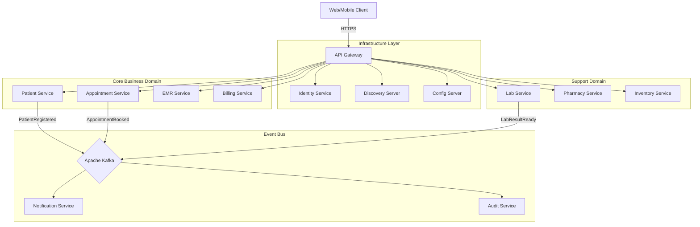

# Mayur HMS – Enterprise Hospital Management Platform


**Mayur HMS** is a cloud-native, event-driven Hospital Information Management System designed for high-scale enterprise environments. It replaces legacy manual processes with a unified, secure platform handling the entire patient lifecycle—from registration to billing.

## 🏗 High-Level Architecture



## ✨ Key Enterprise Features
- **Event-Driven Architecture**: Decoupled services communicating asynchronously via Apache Kafka.
- **Microservices Pattern**: Independence of specific domain logic (Patient, Billing, EMR).
- **Centralized Configuration**: Spring Cloud Config for managing properties across all environments.
- **Service Discovery**: Netflix Eureka for dynamic scaling and service registration.
- **API Gateway**: Centralized entry point with rate limiting and routing.
- **Distributed Tracing**: Zipkin integration for tracking requests across microservices.
- **Security First**: OAuth2/OIDC integration with Keycloak and RBAC.

## 🛠 Technology Stack

### Backend & Middleware
- **Framework**: Spring Boot 3.x, Spring Cloud
- **Language**: Java 17
- **Messaging**: Apache Kafka, Zookeeper
- **Database**: PostgreSQL (Transactional), MongoDB (Documents), Redis (Cache)
- **Security**: Spring Security, Keycloak (OAuth2)

### DevSecOps
- **Containerization**: Docker, Jib
- **Orchestration**: Docker Compose (Local), Kubernetes (Production Ready)
- **CI/CD**: GitHub Actions (Automated Build & Deploy)
- **Observability**: Prometheus, Grafana, Zipkin

## 🚀 deployment (3 Ways)

### 1. Quick Start (Local)
Best for development and debugging. runs infrastructure in Docker, apps on host.
```bash
git clone https://github.com/mayurkukatkar/Hospital-software-Microservices-Architecture-.git
docker-compose up -d       # Starts DBs, Kafka, Redis
./start_backend.ps1        # Starts Core Backend Services
cd frontend && npm run dev # Starts UI
```

### 2. Full Stack (Docker)
Runs the entire platform (15+ containers) with one command.
```bash
docker-compose -f docker-compose.app.yml up -d --build
```

### 3. Production (DigitalOcean)
Fully automated CI/CD pipeline included.
1.  **Push** to `main`.
2.  **GitHub Actions** builds Maven/NPM projects.
3.  **Automated Deploy** to DigitalOcean Droplet via SSH.

---
© 2024 Mayur HMS. Confidential.
